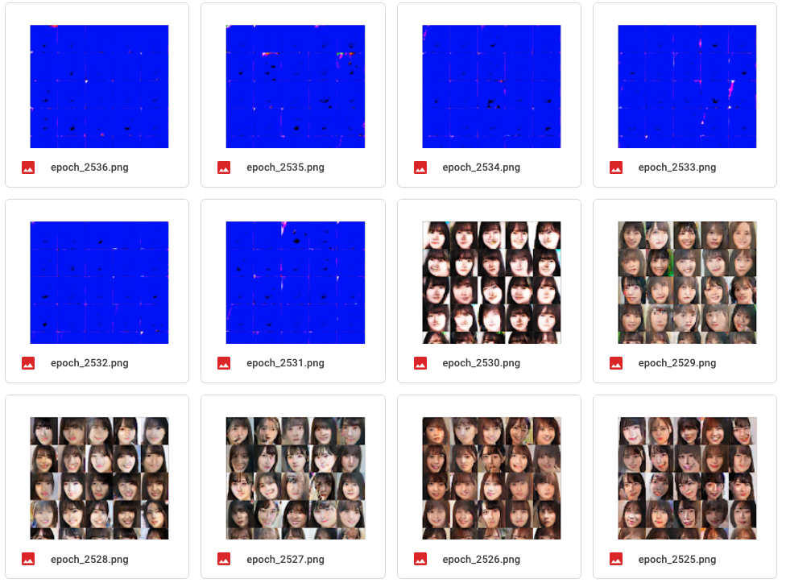

## memo
- [lightweight-gan](https://pythonrepo.com/repo/lucidrains-lightweight-gan-python-deep-learning)気になる


## 結果

### 生成画像
2500 エポック終了時の生成画像。


### 学習が進まない
discriminator が強くなりすぎることで、学習が進まなくことが多いらしい。（ほとんどの画像に対して見分けをつけてしまって、騙し合いにならないため。）

そのため、損失関数に開きができすぎてたら学習を飛ばすようにしている。

``` python
# discriminator が強くなりすぎてたら学習をスキップさせる
if (len(loss_gens) == 0) or (len(loss_gens) > 0 and loss_gens[-1] / loss_discs[-1] < 2):
    grads = disc_tape.gradient(loss_disc, discriminator.trainable_weights)
    opt_disc.apply_gradients(
        zip(grads, discriminator.trainable_weights)
    )
else:
    print('skipped generator training')
```

### 損失関数推移


### 不安定性
突然崩れる時がある

#### 1


#### 2


#### 3



#### 4
モード崩壊


