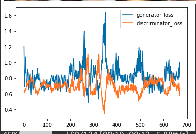
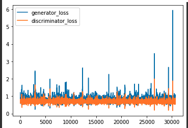

## memo
- [ここ](../../akimoto/results/6th/memo.md)で選別した画像によって学習を行わせたが、細部が詰めきれない。
    - 4200 枚、700 epoch やってみた(200とかからあんまり変わらない？？)
    - 数値化するの忘れてた
- Discriminator が強すぎる？
    - 一般に、GANの学習は安定しにくく、Discriminatorが圧勝してしまうことが多いらしい
    - [解決策](https://gangango.com/2018/11/16/post-322/)

700 epoch からの、6 epoch 分のデータ（700 iter くらい）だが、そんなに悪くはなさそう？

もう少し続けてみる

200エポックくらい続けたけど、一向に loss が減ってない。これが原因？

