## Self-Attention GAN

## 比較
DCGAN と SAGAN (Self-Attention GAN)の学習速度・精度の比較

| epoch | DCGAN | SAGAN |
| --- | --- | --- |
| 0 | 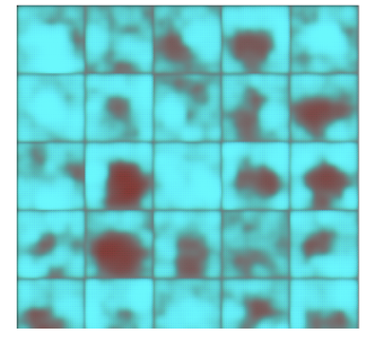 |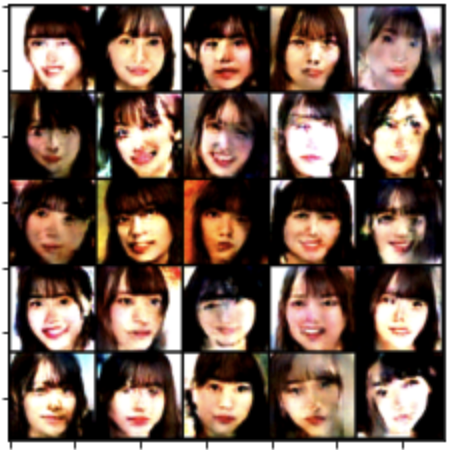|
| 5 | 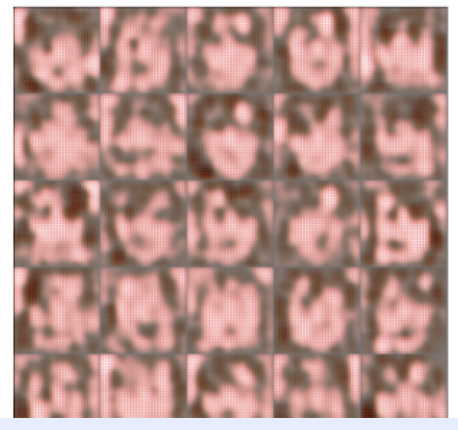 |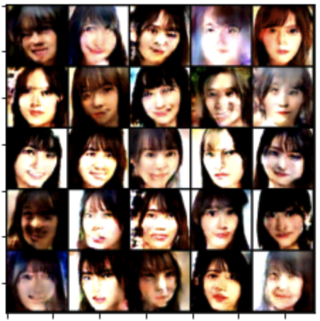|
| 10 | 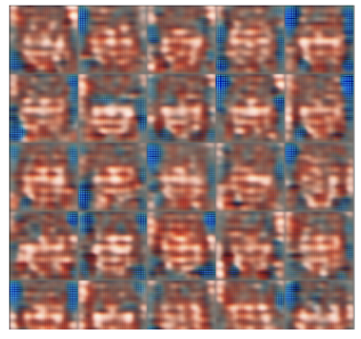 |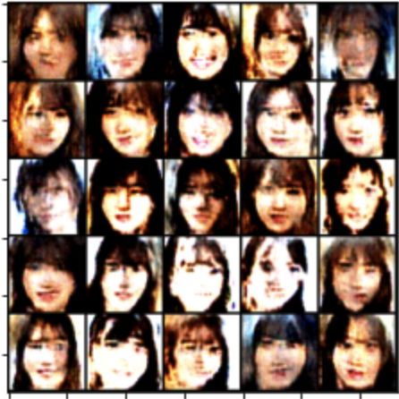|
| 15 | 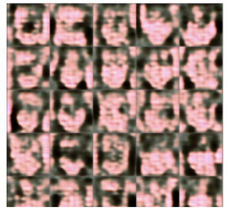 |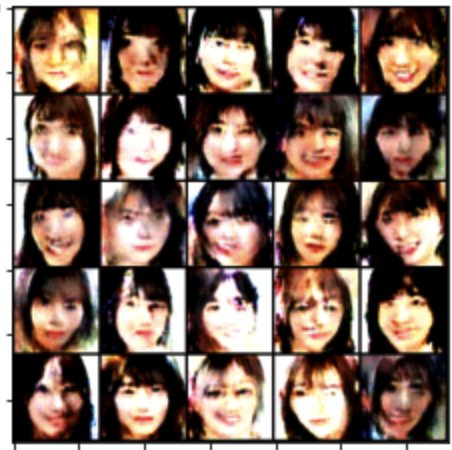|
| 30 | 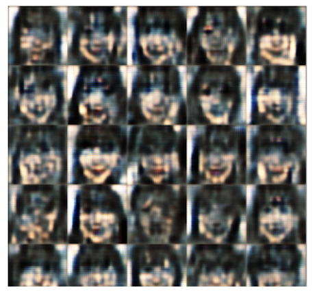 |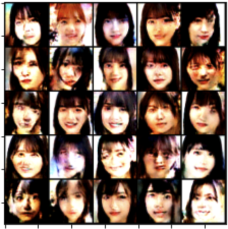|
| 50 |  |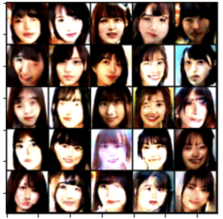|
| 100 | 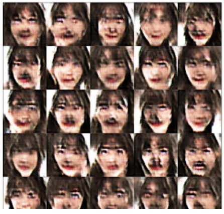 |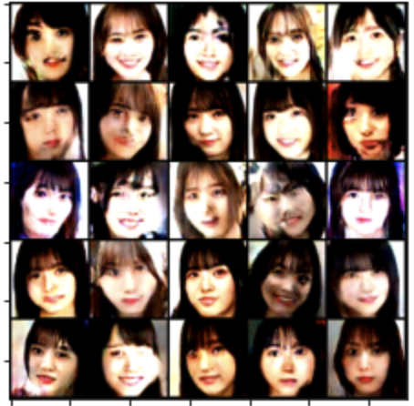|
| 150 | 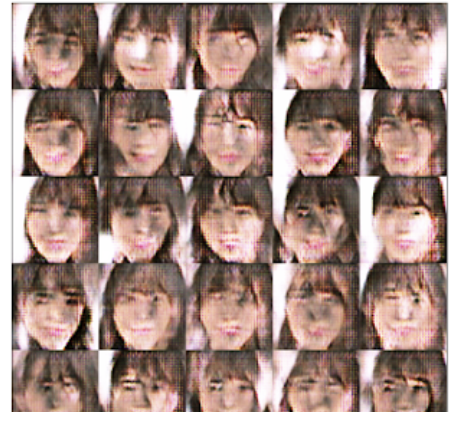 |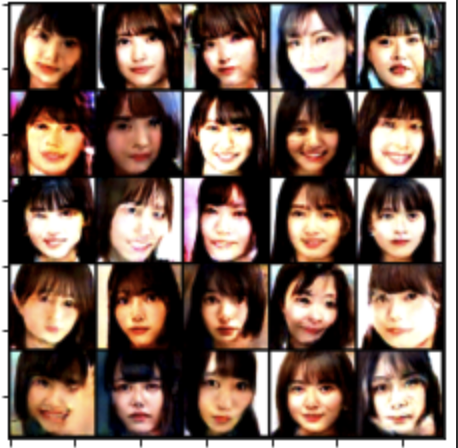|
| 200 |  |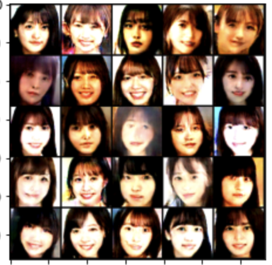|
| 250 | 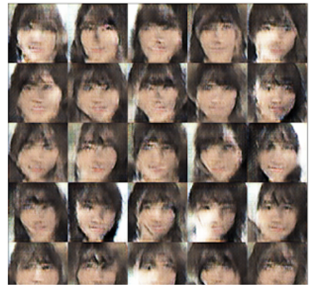 |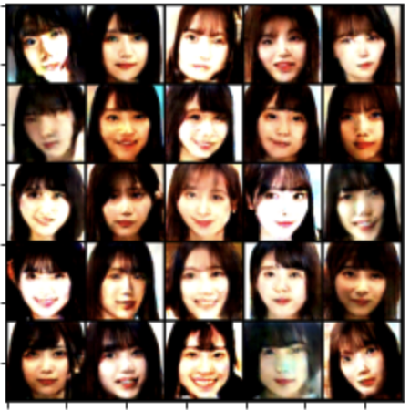|
| 300 | 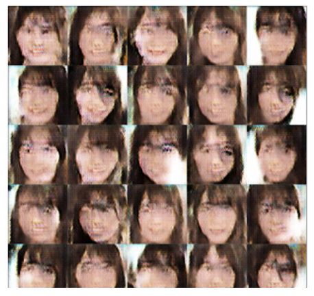 |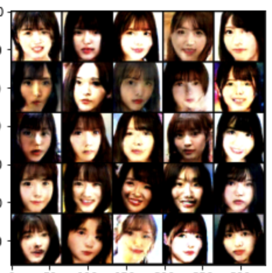|
| 400 | 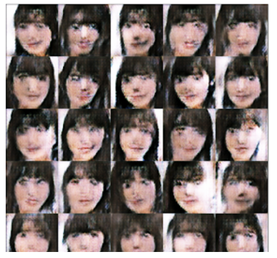 |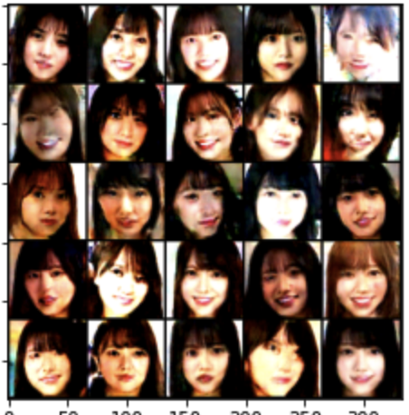|
| 500 | 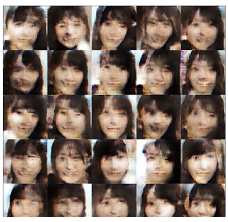 |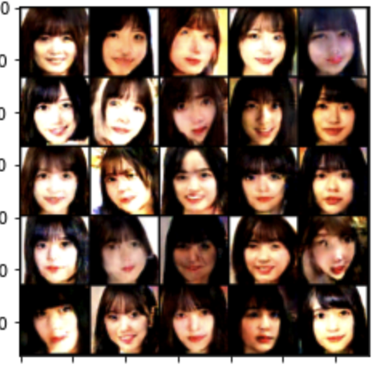|
